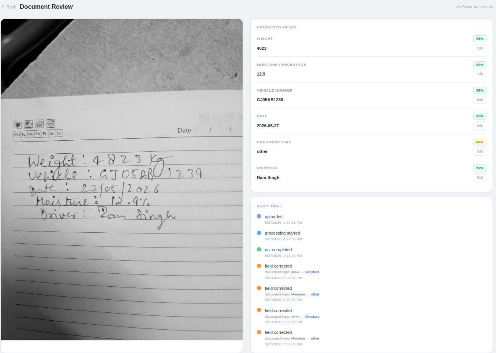
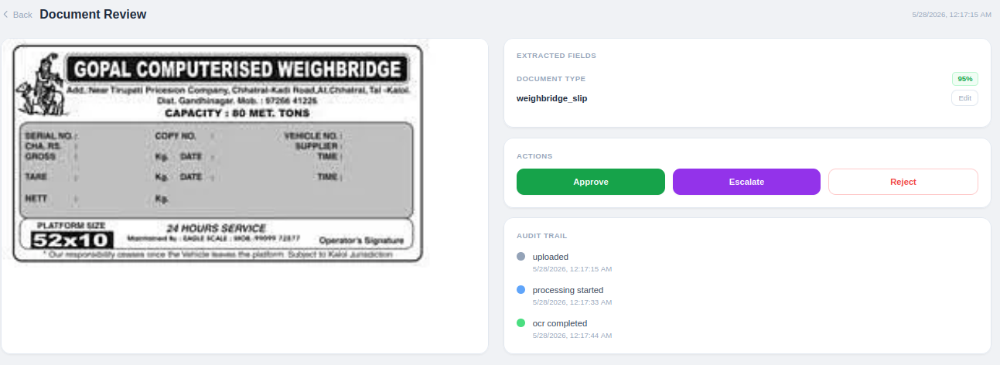

# Climitra — dMRV Document Capture & Review Pipeline

A mobile-first document digitisation system for carbon credit verification. Field workers photograph biomass purchase documents on low-end Android phones; GPT-4o extracts structured fields; HQ reviewers verify, correct, and approve — all with a full audit trail.

---

## Screenshots

**Dispatch Challan — GPT-4o extracted fields with per-field confidence scores**


**Handwritten Notebook — OCR extraction with green/yellow/red confidence colour coding**


**Audit Trail — append-only log of every field correction made by reviewer**


**Blank Weighbridge Template — GPT classifies document type but extracts no field values (no hallucination)**


---

## What It Does

| Role | Flow |
|------|------|
| **Field Worker (Ram)** | Opens PWA on phone → captures document photo → app queues + uploads → sees status update |
| **Reviewer (HQ)** | Opens dashboard → sees queue sorted by confidence → reviews extracted fields → approves / rejects / escalates |

Document types supported: `weighbridge_slip`, `moisture_reading`, `dispatch_challan`, `other`

---

## Architecture

```
[Field Worker Phone]
        │  HTTPS multipart upload
        ▼
[Express API — Node.js]
  ├── Sharp preprocess (deskew, contrast, sharpen)
  ├── Perceptual hash → duplicate detection
  ├── Upload to Supabase Storage (full resolution)
  ├── Write capture record (status: pending)
  └── Push job → Bull queue (Redis)
        │
        ▼
[Bull Worker — separate process]
  ├── Download full-res image from Supabase
  ├── Base64 encode → GPT-4o Vision API
  ├── Parse structured fields + confidence scores
  ├── Validate fields (RTO format, date ISO, weight range)
  ├── Write to capture_fields table
  ├── Update capture status → needs_review
  └── Append ocr_completed event
        │
        ▼
[Reviewer Dashboard — Next.js 14 PWA]
  ├── /review — queue with status tabs
  ├── /review/:id — split screen (image + fields)
  ├── /dashboard — stats + full capture list
  └── /search — filter + CSV export
```

---

## Tech Stack

| Layer | Choice |
|-------|--------|
| Frontend | Next.js 14, Tailwind CSS, next-pwa |
| Backend | Node.js, Express 5 |
| OCR | OpenAI GPT-4o Vision API |
| Queue | Bull + Redis |
| Database | Supabase (PostgreSQL) |
| Storage | Supabase Storage |
| Image processing | Sharp |
| Auth | JWT (RS256), bcrypt |

---

## Database Schema

```sql
captures          — one row per document photo
capture_fields    — one row per extracted field (weight, vehicle_no, date, …)
capture_events    — append-only audit log (every state change, every edit)
users             — field_worker | reviewer roles
```

**Key rule:** `capture_events` is append-only. No field is ever overwritten silently — every correction writes a `field_corrected` event with old value, new value, reviewer ID, and timestamp.

---

## Local Setup

### Prerequisites
- Node.js 18+
- Redis running locally (`redis-server`)
- Supabase project (free tier works)
- OpenAI API key

### 1. Clone & install

```bash
git clone git@github.com:Aryan-Elite/climitra.git
cd climitra

cd backend && npm install
cd ../frontend && npm install
```

### 2. Environment variables

**`backend/.env`**
```
PORT=5000
SUPABASE_URL=your_supabase_url
SUPABASE_SERVICE_KEY=your_service_role_key
OPENAI_API_KEY=your_openai_key
JWT_SECRET=any_random_secret
REDIS_URL=redis://localhost:6379
```

**`frontend/.env.local`**
```
NEXT_PUBLIC_API_URL=http://localhost:5000
```

### 3. Supabase setup

Run this SQL in your Supabase SQL editor:

```sql
create table users (
  id uuid primary key default gen_random_uuid(),
  email text unique not null,
  password_hash text not null,
  role text not null check (role in ('field_worker', 'reviewer')),
  name text,
  created_at timestamptz default now()
);

create table captures (
  id uuid primary key default gen_random_uuid(),
  image_bucket text not null,
  image_path text not null,
  image_hash text,
  document_type text,
  status text not null default 'pending',
  uploaded_by uuid references users(id),
  uploaded_at timestamptz default now()
);

create table capture_fields (
  id uuid primary key default gen_random_uuid(),
  capture_id uuid references captures(id) on delete cascade,
  field_name text not null,
  ocr_value text,
  current_value text,
  confidence float,
  is_human_corrected boolean default false,
  corrected_by uuid references users(id),
  corrected_at timestamptz
);

create table capture_events (
  id uuid primary key default gen_random_uuid(),
  capture_id uuid references captures(id) on delete cascade,
  event_type text not null,
  actor_id uuid references users(id),
  actor_type text,
  field_name text,
  old_value text,
  new_value text,
  created_at timestamptz default now()
);
```

Create a public storage bucket named `captures` in Supabase Storage.

Create a reviewer account:

```sql
insert into users (email, password_hash, role, name)
values ('reviewer@climitra.com', '$2b$10$...', 'reviewer', 'HQ Reviewer');
```

(Generate the hash with `node -e "const b=require('bcryptjs'); b.hash('password123',10).then(console.log)"`)

### 4. Run

```bash
# Terminal 1 — API
cd backend && npm run dev

# Terminal 2 — OCR Worker
cd backend && npm run worker

# Terminal 3 — Frontend
cd frontend && npm run dev
```

Open `http://localhost:3000` → login → start reviewing.

### Test Credentials

| Role | Email | Password | Access |
|------|-------|----------|--------|
| Reviewer (HQ) | `reviewer@climitra.com` | `password123` | Dashboard, Review Queue, Search |
| Field Worker | `ram@climitra.com` | `password123` | Capture page only |

---

## Key Decisions & Tradeoffs

### 1. Store `image_path` not full URL in DB
Supabase Storage public URLs include the bucket name and can change if the bucket is renamed or the project is migrated. Storing only `image_path` (e.g. `d94b3a8b.jpg`) and calling `getPublicUrl()` at query time keeps the DB portable and lets us swap storage providers without a migration.

**Tradeoff:** Every API response reconstructs the URL server-side. Minor overhead, major flexibility.

### 2. Separate OCR worker process (Bull queue)
GPT-4o Vision calls take 5–15 seconds. Doing this synchronously in the upload request would timeout mobile connections. The queue decouples upload (instant response) from processing (async), and gives us retry logic for free if OpenAI is temporarily unavailable.

**Tradeoff:** Adds Redis as a dependency. Worth it — without this, one slow OCR call blocks the entire upload endpoint.

### 3. GPT-4o self-reported confidence scores
We ask GPT to rate its own confidence (0–1) per field rather than computing it ourselves. This is simpler and actually more accurate for this use case — GPT can see the image and knows how clearly it read each value.

**Tradeoff:** Not statistically calibrated (0.9 doesn't mean 90% accuracy mathematically). For the review workflow, the relative ordering (green/yellow/red) is what matters — not the absolute number.

### 4. Append-only audit trail
Every field correction and every status change appends a row to `capture_events`. Nothing is ever updated in-place in the audit table. This makes the system audit-ready for carbon credit verification (MRV requires full change history) and makes debugging trivial.

**Tradeoff:** `capture_events` grows unboundedly. At scale, needs partitioning by month or archival to cold storage.

### 5. Sharp preprocessing before OCR
Images are deskewed, contrast-enhanced, and sharpened server-side before being sent to GPT-4o. Field photos taken on low-end phones in field conditions (poor lighting, angles, glare) benefit significantly from preprocessing — it visibly improves OCR accuracy on blurry or dark images.

**Tradeoff:** Adds ~200-500ms to upload time. Acceptable — the alternative is worse OCR accuracy and more manual correction work for reviewers.

---

## Assumptions

- Field workers have basic smartphones with cameras and intermittent internet (2G/3G acceptable for upload after preprocessing)
- Documents are in Hindi or English; GPT-4o handles both without special configuration
- One weighbridge slip = one capture (no multi-page documents in v1)
- Vehicle numbers follow Gujarat RTO format (GJ-XX-XX-XXXX) — validation flags deviations for reviewer attention
- Reviewers work on desktop/laptop — the reviewer dashboard is not mobile-optimised
- Supabase free tier is sufficient for the demo (500MB storage, 2GB bandwidth)

---

## What Breaks First at 100x Scale

| Bottleneck | Why | Fix |
|------------|-----|-----|
| **OpenAI rate limits** | GPT-4o has TPM/RPM caps. 100x uploads = queue backup, OCR delay spikes | Implement exponential backoff + priority queue; evaluate fine-tuned smaller model for common doc types |
| **Single Redis instance** | Bull queue backed by one Redis node — no HA | Redis Sentinel or Redis Cluster |
| **Supabase connection pool** | Supabase free/pro has 60 connection limit. 100x API traffic exhausts it | Add PgBouncer in transaction mode |
| **`capture_events` table size** | Append-only + 100x volume = millions of rows fast | Partition by month, archive to S3/cold storage after 90 days |
| **Sharp preprocessing CPU** | All image processing on single backend process | Move to a dedicated worker or serverless function (AWS Lambda with Sharp layer) |

---

## Handling the Binding Constraints

**Mobile-first capture.** The capture surface is a PWA — no app store, works on any Android browser. The UI is a single large camera button with a file upload fallback. No jargon, no forms, no navigation. The field worker sees one thing: take a photo. Status updates (queued / uploading / processing / done) are displayed in large text with high contrast so they're readable in sunlight.

**Intermittent connectivity.** Uploads that fail due to no internet are saved to IndexedDB in the browser before attempting the network request. On reconnect, the offline sync hook automatically retries all pending uploads in order. The field worker never sees a failed upload — they see a "queued" status that resolves itself. This is treated as a first-class flow, not a fallback.

**Audit trail.** The `capture_events` table is append-only. No field in the system is ever overwritten silently — every correction writes a new event row with the old value, new value, reviewer ID, actor type (human/system), and timestamp. The schema separates current state (`captures`, `capture_fields`) from full history (`capture_events`). The review interface shows the complete event timeline per capture. A registry audit months later can reconstruct exactly what the OCR said, what a reviewer changed, and when.

**Confidence must be visible.** Confidence is per field, not per document. Each field in the review interface is colour-coded: green (≥ 85%), yellow (60–85%), red (< 60%). The reviewer's eye goes to red fields first. There is no green tick on everything — if GPT is uncertain about a value, it says so and the UI shows it. Confidence scores are also stored in `capture_fields` so they are part of the permanent audit record, not just a UI decoration.

---

## Capability Picks

### 1. Background Job Queues — Bucket 1 (Reliability)

**Why:** OCR takes 10–30 seconds per document. A synchronous request on a 2G connection in a Gujarat village will time out more often than it succeeds. The queue decouples upload from processing — upload returns immediately, processing happens in the background via Bull and Redis.

**Impact on the system:** This shaped the entire capture flow: upload → acknowledge → queue → process → notify. Retry logic lives in the worker, not the API. The dashboard polls for status rather than blocking on a request. If OCR fails, the job retries automatically without the user doing anything. Without this pick, a single slow OCR call would block the upload endpoint for every concurrent user.

**What I rejected:** Synchronous processing with a long timeout. Simple to build, but fundamentally incompatible with the mobile and connectivity constraints. A field worker on 2G cannot hold a connection open for 30 seconds.

---

### 2. OCR Confidence Scoring — Bucket 2 (OCR Quality)

**Why:** Without per-field confidence, a reviewer manually checks every field of every capture. With it, they focus on red fields and trust green ones. In a system where a misread tonnage figure affects how many credits get issued, this is the mechanism that makes review workable — not a quality-of-life add-on.

**Impact on the system:** Scores drive colour-coding in the review interface, determine queue sort order (lowest confidence first), and are recorded in the audit log so you can see if a high-confidence field was later corrected by a human. The review interface is shaped around this — without confidence scores, the split-screen layout loses its purpose.

**What I rejected:** Document-level confidence. A single score per document masks individual field errors — a document can have four perfect fields and one badly misread weight. Per-field is the only granularity that is actionable for a reviewer.

---

### 3. Duplicate Detection — Bucket 3 (Discovery)

**Why:** Submitting the same weighbridge slip twice isn't a data quality issue — it's potentially fraudulent double-counting. Field workers in low-connectivity areas often upload the same slip multiple times unsure if the first went through. Without detection, both entries can get approved and both sets of credits get claimed.

**Impact on the system:** Every upload triggers a perceptual hash check before entering the processing queue. A near-duplicate surfaces in a `possible_duplicate` state and requires explicit reviewer action. Added a `possible_duplicate` state to the capture status flow and a `duplicate_check` event to the audit log. Without this, the queue has no way to distinguish a retry from a second document.

**What I rejected:** Vector search for semantic duplicate detection — more powerful but requires embedding infrastructure and adds latency to every upload. Perceptual hashing catches the actual risk (same physical document photographed twice) without that overhead.

---

### 4. Human-in-the-Loop Workflows — Bucket 4 (User Experience)

**Why:** OCR will make mistakes on real field photos. Full automation isn't safe in a context where a wrong number affects carbon credit issuance. But manual review of every field of every capture doesn't scale. The structured workflow surfaces uncertain captures to reviewers and lets clear ones move faster.

**Impact on the system:** The entire review interface exists because of this pick. The status flow (pending → processing → needs_review → approved/rejected/escalated) is a direct expression of it. The escalate action lets reviewers flag captures for a second opinion without blocking the queue. Without this pick, the system has no structured handoff between machine extraction and human verification.

**What I rejected:** Fully automated approval above a confidence threshold. Simpler to implement, but harder to defend to a registry auditor than a human-reviewed record. In a carbon credit context, the audit trail needs a named human approver on every capture.

---

### 5. Audit Logs — Wildcard

**Why:** A carbon credit registry audit can happen months after the data was collected. Without an append-only event log, you only have the current state of the data — the history is gone. In this context that is a compliance failure, not a minor inconvenience.

**Impact on the system:** Every mutation goes through an event write before hitting the database. No direct field overwrites anywhere in the codebase. The schema has two parts: a `captures` table (current state) and a `capture_events` table (full history). The review interface shows the event timeline per capture. This pick made the schema more complex but non-negotiable given the MRV context.

**What I rejected:** Field-level versioning on the capture record itself — storing previous values in the same row. This only tracks the last change. An event log retains every state transition in order, which is what a real audit requires.

---

## Sample Test Images

Located in `test-images/`. Mix of clean and difficult cases as required.

| File | Classified As | What the system does | In scope? |
|------|--------------|----------------------|-----------|
| `weighbridge-filled.jpeg` | `weighbridge_slip` | Clean printed slip — all fields (weight, vehicle no, date) extracted with high confidence (green). Best-case scenario. | ✅ Yes |
| `weighbridge-blank-template.jpeg` | `weighbridge_slip` | Blank Gopal Computerised Weighbridge form — no values filled in. GPT correctly classifies document type at 80% confidence but extracts zero field values. Demonstrates the system does not hallucinate data when fields are genuinely absent. Screenshot: `docs/blank-weighbridge-no-hallucination.png` | ✅ Yes |
| `dispatch-challan-printed.webp` | `dispatch_challan` | Printed logistics payment challan — date and driver name extract correctly. Vehicle number may differ from expected GJ format (Nagaland RTO in this sample). Moisture field not present — GPT correctly omits it. | ✅ Yes |
| `handwritten-notebook-clean.jpeg` | `other` | Handwritten biomass purchase notebook — all 5 fields extracted correctly at high confidence. Used as the primary demo document throughout development. | ✅ Yes |
| `handwritten-notebook-blurry-occluded.jpeg` | `other` | Same document type but blurry with partial finger occlusion — confidence drops to yellow/red on several fields. Reviewer is prompted to manually verify. Tests the low-confidence escalation flow. | ✅ Yes — hard case |

**Note:** Documents not in scope for v1 — multi-page PDFs, moisture meter LCD screen photos, and documents with non-Latin scripts beyond Hindi/English. These would require additional preprocessing and prompt tuning.

---

## Project Structure

```
climitra/
├── backend/
│   └── src/
│       ├── routes/          # captures.js, auth.js, dashboard.js
│       ├── middleware/       # JWT auth
│       ├── lib/             # Supabase client
│       ├── worker/          # Bull worker + OCR processor
│       └── index.js
├── frontend/
│   ├── app/
│   │   ├── capture/         # Field worker upload page
│   │   ├── review/          # Review queue + detail page
│   │   ├── dashboard/       # Stats + capture list
│   │   └── search/          # Filter + CSV export
│   └── src/
│       ├── components/      # ReviewShell sidebar
│       ├── lib/             # api.ts, db.ts (IndexedDB)
│       └── hooks/
└── test-images/
```
