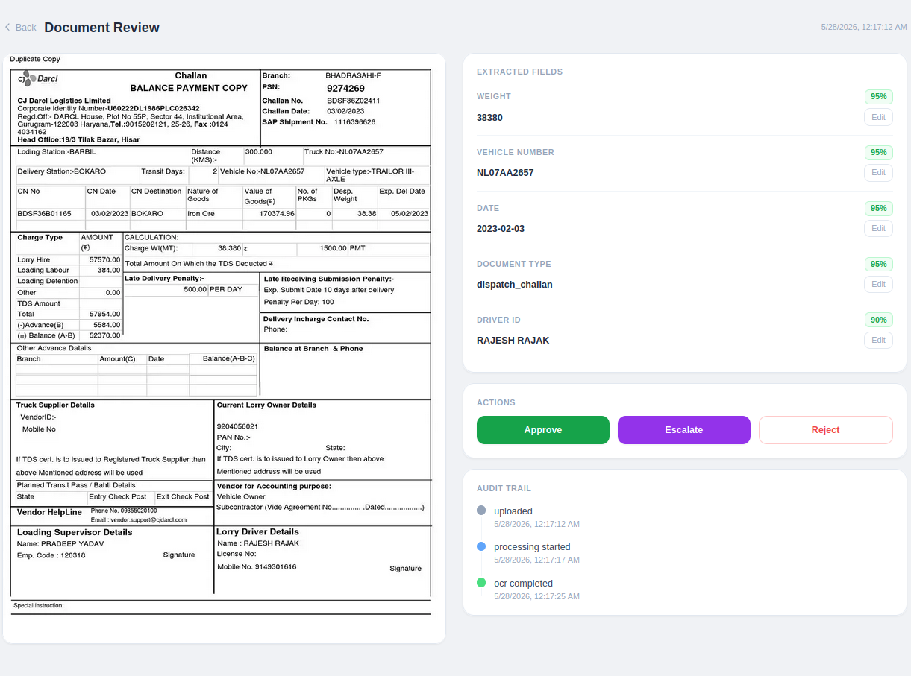
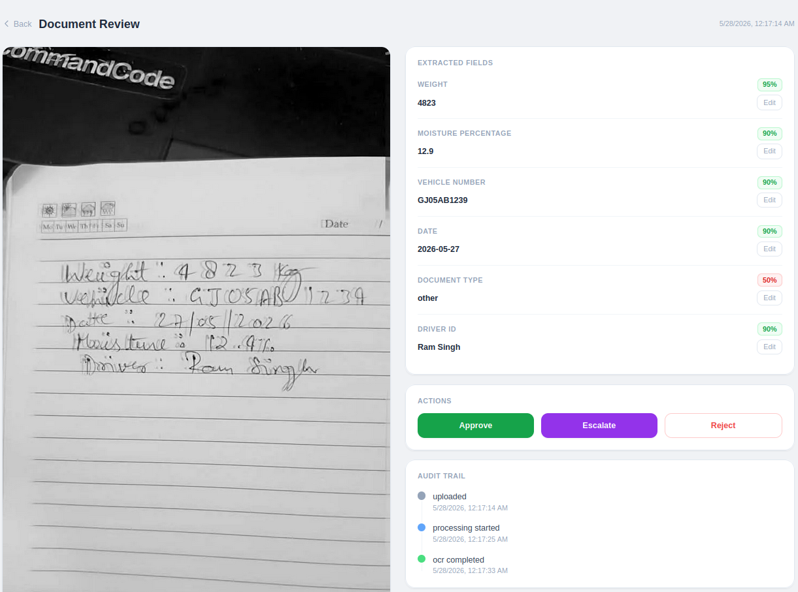

# Climitra — dMRV Document Capture & Review Pipeline

A mobile-first document digitisation system for carbon credit verification. Field workers photograph biomass purchase documents on low-end Android phones; GPT-4o extracts structured fields; HQ reviewers verify, correct, and approve — all with a full audit trail.

---

## Screenshots

**Dispatch Challan — extracted fields with confidence scores**


**Handwritten Notebook — OCR extraction + audit trail**


---

## What It Does

| Role | Flow |
|------|------|
| **Field Worker (Ram)** | Opens PWA on phone → captures document photo → app queues + uploads → sees status update |
| **Reviewer (HQ)** | Opens dashboard → sees queue sorted by confidence → reviews extracted fields → approves / rejects / escalates |

Document types supported: `weighbridge_slip`, `moisture_reading`, `dispatch_challan`, `other`

---

## Architecture

```
[Field Worker Phone]
        │  HTTPS multipart upload
        ▼
[Express API — Node.js]
  ├── Sharp preprocess (deskew, contrast, sharpen)
  ├── Perceptual hash → duplicate detection
  ├── Upload to Supabase Storage (full resolution)
  ├── Write capture record (status: pending)
  └── Push job → Bull queue (Redis)
        │
        ▼
[Bull Worker — separate process]
  ├── Download full-res image from Supabase
  ├── Base64 encode → GPT-4o Vision API
  ├── Parse structured fields + confidence scores
  ├── Validate fields (RTO format, date ISO, weight range)
  ├── Write to capture_fields table
  ├── Update capture status → needs_review
  └── Append ocr_completed event
        │
        ▼
[Reviewer Dashboard — Next.js 14 PWA]
  ├── /review — queue with status tabs
  ├── /review/:id — split screen (image + fields)
  ├── /dashboard — stats + full capture list
  └── /search — filter + CSV export
```

---

## Tech Stack

| Layer | Choice |
|-------|--------|
| Frontend | Next.js 14, Tailwind CSS, next-pwa |
| Backend | Node.js, Express 5 |
| OCR | OpenAI GPT-4o Vision API |
| Queue | Bull + Redis |
| Database | Supabase (PostgreSQL) |
| Storage | Supabase Storage |
| Image processing | Sharp |
| Auth | JWT (RS256), bcrypt |

---

## Database Schema

```sql
captures          — one row per document photo
capture_fields    — one row per extracted field (weight, vehicle_no, date, …)
capture_events    — append-only audit log (every state change, every edit)
users             — field_worker | reviewer roles
```

**Key rule:** `capture_events` is append-only. No field is ever overwritten silently — every correction writes a `field_corrected` event with old value, new value, reviewer ID, and timestamp.

---

## Local Setup

### Prerequisites
- Node.js 18+
- Redis running locally (`redis-server`)
- Supabase project (free tier works)
- OpenAI API key

### 1. Clone & install

```bash
git clone git@github.com:Aryan-Elite/climitra.git
cd climitra

cd backend && npm install
cd ../frontend && npm install
```

### 2. Environment variables

**`backend/.env`**
```
PORT=5000
SUPABASE_URL=your_supabase_url
SUPABASE_SERVICE_KEY=your_service_role_key
OPENAI_API_KEY=your_openai_key
JWT_SECRET=any_random_secret
REDIS_URL=redis://localhost:6379
```

**`frontend/.env.local`**
```
NEXT_PUBLIC_API_URL=http://localhost:5000
```

### 3. Supabase setup

Run this SQL in your Supabase SQL editor:

```sql
create table users (
  id uuid primary key default gen_random_uuid(),
  email text unique not null,
  password_hash text not null,
  role text not null check (role in ('field_worker', 'reviewer')),
  name text,
  created_at timestamptz default now()
);

create table captures (
  id uuid primary key default gen_random_uuid(),
  image_bucket text not null,
  image_path text not null,
  image_hash text,
  document_type text,
  status text not null default 'pending',
  uploaded_by uuid references users(id),
  uploaded_at timestamptz default now()
);

create table capture_fields (
  id uuid primary key default gen_random_uuid(),
  capture_id uuid references captures(id) on delete cascade,
  field_name text not null,
  ocr_value text,
  current_value text,
  confidence float,
  is_human_corrected boolean default false,
  corrected_by uuid references users(id),
  corrected_at timestamptz
);

create table capture_events (
  id uuid primary key default gen_random_uuid(),
  capture_id uuid references captures(id) on delete cascade,
  event_type text not null,
  actor_id uuid references users(id),
  actor_type text,
  field_name text,
  old_value text,
  new_value text,
  created_at timestamptz default now()
);
```

Create a public storage bucket named `captures` in Supabase Storage.

Create a reviewer account:

```sql
insert into users (email, password_hash, role, name)
values ('reviewer@climitra.com', '$2b$10$...', 'reviewer', 'HQ Reviewer');
```

(Generate the hash with `node -e "const b=require('bcryptjs'); b.hash('password123',10).then(console.log)"`)

### 4. Run

```bash
# Terminal 1 — API
cd backend && npm run dev

# Terminal 2 — OCR Worker
cd backend && npm run worker

# Terminal 3 — Frontend
cd frontend && npm run dev
```

Open `http://localhost:3000` → login → start reviewing.

---

## Key Decisions & Tradeoffs

### 1. Store `image_path` not full URL in DB
Supabase Storage public URLs include the bucket name and can change if the bucket is renamed or the project is migrated. Storing only `image_path` (e.g. `d94b3a8b.jpg`) and calling `getPublicUrl()` at query time keeps the DB portable and lets us swap storage providers without a migration.

**Tradeoff:** Every API response reconstructs the URL server-side. Minor overhead, major flexibility.

### 2. Separate OCR worker process (Bull queue)
GPT-4o Vision calls take 5–15 seconds. Doing this synchronously in the upload request would timeout mobile connections. The queue decouples upload (instant response) from processing (async), and gives us retry logic for free if OpenAI is temporarily unavailable.

**Tradeoff:** Adds Redis as a dependency. Worth it — without this, one slow OCR call blocks the entire upload endpoint.

### 3. GPT-4o self-reported confidence scores
We ask GPT to rate its own confidence (0–1) per field rather than computing it ourselves. This is simpler and actually more accurate for this use case — GPT can see the image and knows how clearly it read each value.

**Tradeoff:** Not statistically calibrated (0.9 doesn't mean 90% accuracy mathematically). For the review workflow, the relative ordering (green/yellow/red) is what matters — not the absolute number.

### 4. Append-only audit trail
Every field correction and every status change appends a row to `capture_events`. Nothing is ever updated in-place in the audit table. This makes the system audit-ready for carbon credit verification (MRV requires full change history) and makes debugging trivial.

**Tradeoff:** `capture_events` grows unboundedly. At scale, needs partitioning by month or archival to cold storage.

### 5. Sharp preprocessing before OCR
Images are deskewed, contrast-enhanced, and sharpened server-side before being sent to GPT-4o. Field photos taken on low-end phones in field conditions (poor lighting, angles, glare) benefit significantly from preprocessing — it visibly improves OCR accuracy on blurry or dark images.

**Tradeoff:** Adds ~200-500ms to upload time. Acceptable — the alternative is worse OCR accuracy and more manual correction work for reviewers.

---

## Assumptions

- Field workers have basic smartphones with cameras and intermittent internet (2G/3G acceptable for upload after preprocessing)
- Documents are in Hindi or English; GPT-4o handles both without special configuration
- One weighbridge slip = one capture (no multi-page documents in v1)
- Vehicle numbers follow Gujarat RTO format (GJ-XX-XX-XXXX) — validation flags deviations for reviewer attention
- Reviewers work on desktop/laptop — the reviewer dashboard is not mobile-optimised
- Supabase free tier is sufficient for the demo (500MB storage, 2GB bandwidth)

---

## What Breaks First at 100x Scale

| Bottleneck | Why | Fix |
|------------|-----|-----|
| **OpenAI rate limits** | GPT-4o has TPM/RPM caps. 100x uploads = queue backup, OCR delay spikes | Implement exponential backoff + priority queue; evaluate fine-tuned smaller model for common doc types |
| **Single Redis instance** | Bull queue backed by one Redis node — no HA | Redis Sentinel or Redis Cluster |
| **Supabase connection pool** | Supabase free/pro has 60 connection limit. 100x API traffic exhausts it | Add PgBouncer in transaction mode |
| **`capture_events` table size** | Append-only + 100x volume = millions of rows fast | Partition by month, archive to S3/cold storage after 90 days |
| **Sharp preprocessing CPU** | All image processing on single backend process | Move to a dedicated worker or serverless function (AWS Lambda with Sharp layer) |

---

## Binding Constraints Handled

| Constraint | How |
|------------|-----|
| Offline capture | IndexedDB queue in browser — saves upload to local DB when offline, auto-syncs on reconnect |
| Duplicate prevention | Perceptual hash (pHash) computed on upload, compared against all existing captures — exact and near-duplicate detection |
| Full audit trail | Append-only `capture_events` table — every field edit and status change is immutable and timestamped |
| Low-confidence flagging | Per-field confidence score from GPT — colour coded in UI (green ≥ 85%, yellow 60-85%, red < 60%) |
| Image quality | Sharp preprocessing pipeline runs before OCR — deskew, contrast normalisation, sharpening |

---

## Sample Test Images

Located in `test-images/`:

| File | Type | Purpose |
|------|------|---------|
| `weighbridge-filled.jpeg` | weighbridge_slip | Clean case — printed slip with all fields |
| `weighbridge-blank.jpeg` | weighbridge_slip | Low-confidence case — blank template |
| `dispatch-challan.webp` | dispatch_challan | Printed logistics document |
| `handwritten-notebook.jpeg` | other | Baseline handwritten document |
| `handwritten-blurry.jpeg` | other | Hard case — blurry + partial occlusion |

---

## Project Structure

```
climitra/
├── backend/
│   └── src/
│       ├── routes/          # captures.js, auth.js, dashboard.js
│       ├── middleware/       # JWT auth
│       ├── lib/             # Supabase client
│       ├── worker/          # Bull worker + OCR processor
│       └── index.js
├── frontend/
│   ├── app/
│   │   ├── capture/         # Field worker upload page
│   │   ├── review/          # Review queue + detail page
│   │   ├── dashboard/       # Stats + capture list
│   │   └── search/          # Filter + CSV export
│   └── src/
│       ├── components/      # ReviewShell sidebar
│       ├── lib/             # api.ts, db.ts (IndexedDB)
│       └── hooks/
└── test-images/
```
